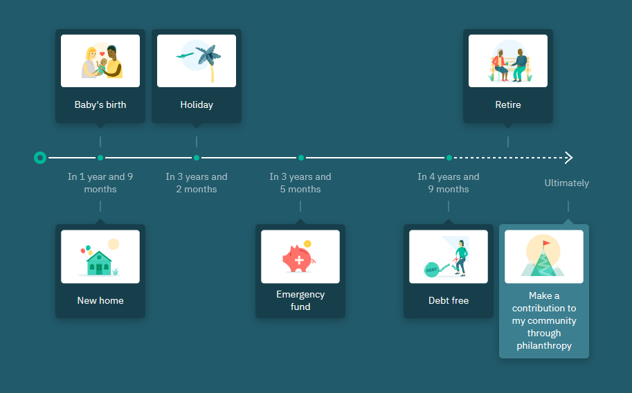
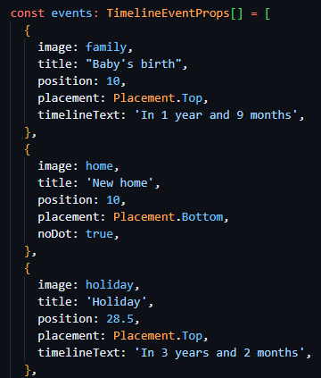

# Timeline-Component

## General Info

This is a component, that displays cards in different variations, across a timeline.

The cards, their positions, content and variation is controlled through by passing props to the timeline.

## Getting Started

TO BE COMPLETED
